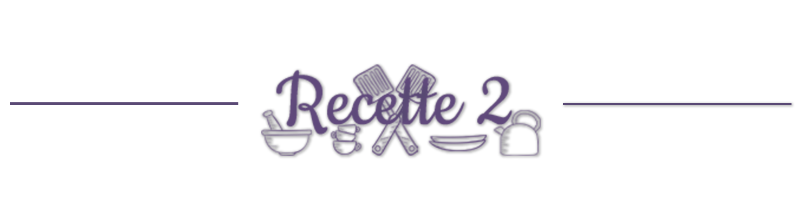
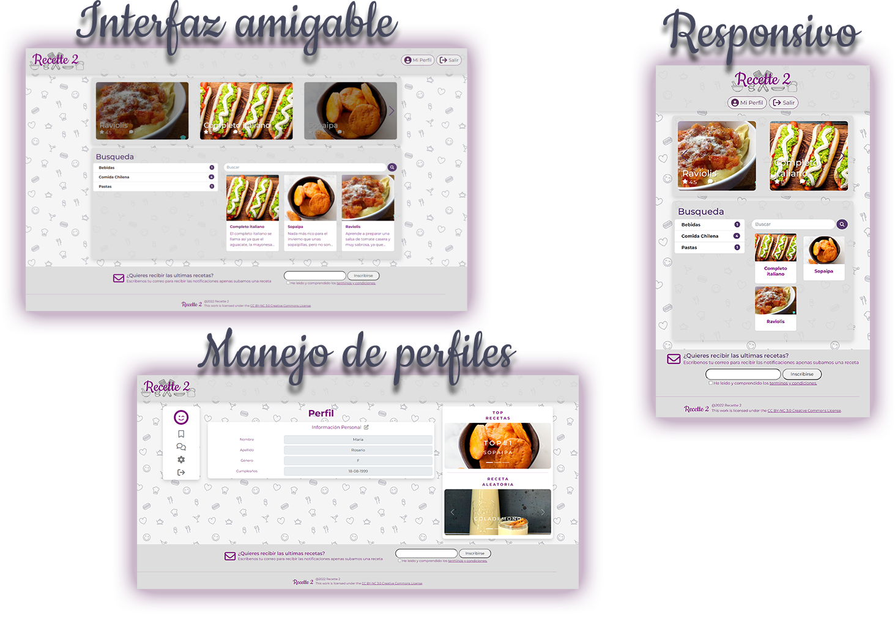

# Recette 2 👨‍🍳

Aplicación web enfocada a la busqueda de recetas con interacciones por parte del usuario 
como comentar, valorar y guardar.
Desarrollada como proyecto semestral correspondiente a la asignatura de Tecnologías Web de Ing. civil en computación e informatica.

## Características

## Tecnologías

- **Presentación:** HTML5, CSS3, JavaScript, Bootstrap, FontAwesome, SwiperJS
- **Lógica:** PHP, jQuery
- **Datos:** MySQL
- **Servicio:** PHP
- **Datos Servicio:** MySQL

## Autores

- [@Alan Arias](https://www.github.com/AlanAriasV)
- [@Camilo Valenzuela](https://www.github.com/mhylos)

## Agradecimientos

Agradecimientos a nuestro profesor de Tecnologías Web por las clases impartidas y retroalimentaciones realizadas.

